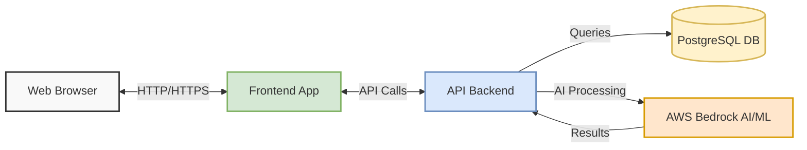
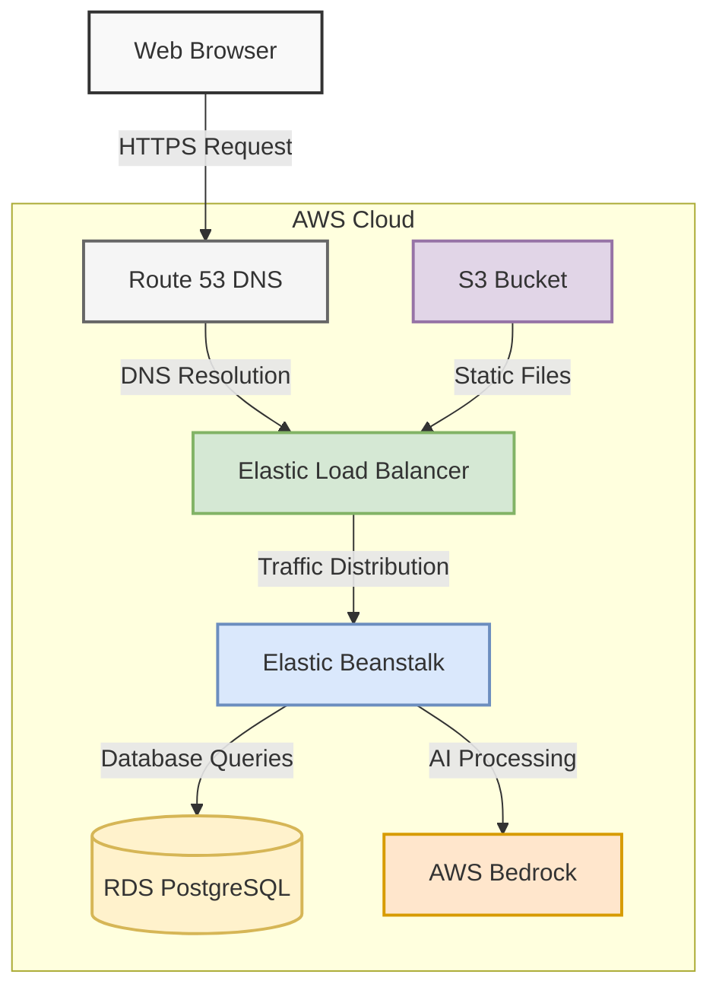
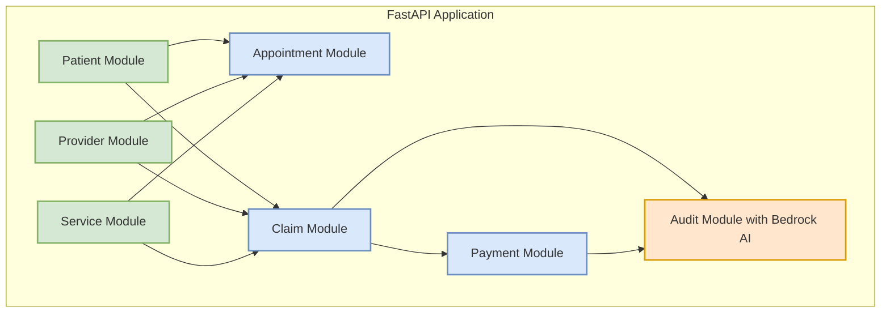
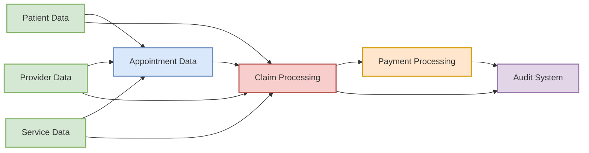
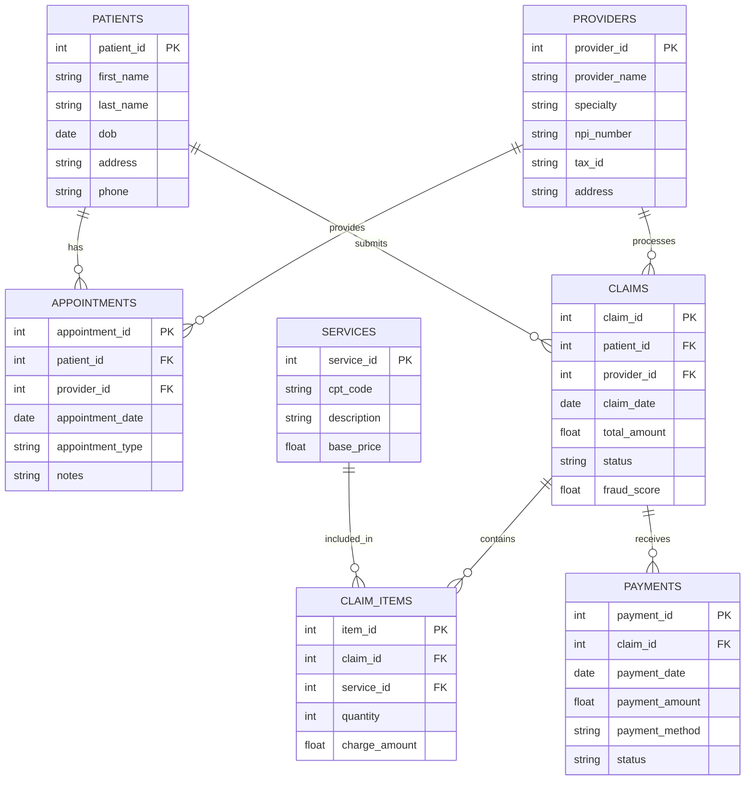

# Medical Billing System - Architectural Diagrams (Mermaid)

## 1. High-Level System Architecture

## 2. AWS Deployment Architecture

## 3. Application Component Architecture

## 4. Data Flow Diagram

## 5. Database Schema Diagram

## 6. Audit Process Flow

```mermaid
graph LR
    A[Claim Submission] -->|Input| B[Format Claim Data for LLM]
    B -->|Formatted Data| C[AWS Bedrock AI Analysis]
    C -->|Analysis Results| D[Calculate Fraud Score]
    D -->|Score & Results| E[ML Fraud Detection]
    E -->|Audit Findings| F[Generate Audit Report]
    F -->|Report| G[Update Claim Status]
    G -->|Final Status| H[Store Audit Results]
    
    style A fill:#d5e8d4,stroke:#82b366,stroke-width:2px
    style B fill:#dae8fc,stroke:#6c8ebf,stroke-width:2px
    style C fill:#ffe6cc,stroke:#d79b00,stroke-width:2px
    style D fill:#e1d5e7,stroke:#9673a6,stroke-width:2px
    style E fill:#f8cecc,stroke:#b85450,stroke-width:2px
    style F fill:#dae8fc,stroke:#6c8ebf,stroke-width:2px
    style G fill:#d5e8d4,stroke:#82b366,stroke-width:2px
    style H fill:#fff2cc,stroke:#d6b656,stroke-width:2px
```

## 7. Deployment Process Flow

